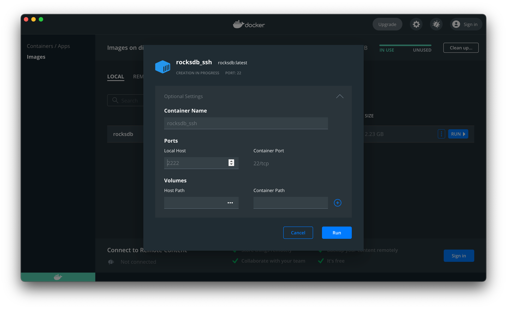

# docker-rocksdb-sshd
Alpine Linux image with compiled and installed RocksDB with all compression libraries with ssh

This's a deprecated branch because it can't be remote on VS Code by remote development.

## Usage

```
git clone https://github.com/liaojack8/docker-rocksdb-sshd && cd docker-rocksdb-sshd
bash build.sh
```


```terminal
ssh root@localhost -p 2222 //login password:rocksdb
cd /tmp
g++ -o example example.cpp -pthread -lrocksdb -std=c++11 && ./example
```